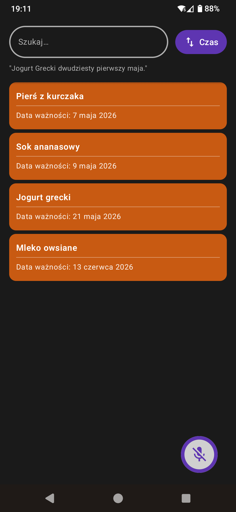

## FoodSaver

A Kotlin + Jetpack Compose Android application meant to help me remember food
that's about to go bad.  
The app is designed for Polish speech input and has a Polish-only UI.  

On first launch, the app prompts the user to download and extract
(around 650 MB, takes a minute) an ASR model, which is hosted as a release in this repository.  
Food entries can be added by voice a short moment after tapping the recording button -  
it may take a second to initialize everything.  
During that time, the app measures background noise and adjusts listening parameters.  
A short beep is then played just before active listening begins.
The entries should be spoken out loud as a series of phrases in the following pattern:  
`<food name> <day of expiry> <month of expiry>`

Longer periods of silence break up the audio into chunks, which, if deemed possible to contain speech, are then processed by the ASR model.  
[sherpa-onnx](https://github.com/k2-fsa/sherpa-onnx) is used as the speech recognition library,
together with the offline ASR model [parakeet-tdt-0.6b-v3](https://huggingface.co/nvidia/parakeet-tdt-0.6b-v3),
courtesy of Nvidia, which was [fine-tuned for Polish](https://huggingface.co/yuriyvnv/parakeet-tdt-0.6b-polish),
courtesy of yuriyvnv, which I then converted to the sherpa-onnx format (using the quantized variant).  
I'm making use of hotwords to boost the recognition of date-related words and some harder to
recognize food names.

The results of ASR processing then undergo some rudimentary language processing,
where words are matched against various forms of day and month names, with some degree of leeway.  
If a proper date can be derived, an entry is formed from the remaining words and stored locally.  
Then a series of notifications is scheduled for the day of expiry of that
entry and for a couple of days before that (the notifications trigger at 5pm local time).  
The entries can be removed by swiping them away, edited by tapping and holding, searched for and
sorted by name and time left to expiry.

<a href="https://www.flaticon.com/free-icons/food-safety" title="food safety icons">Food safety icons created by Defamiravi Studio - Flaticon</a>